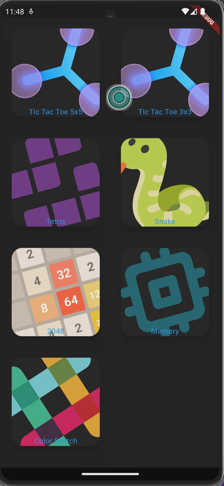
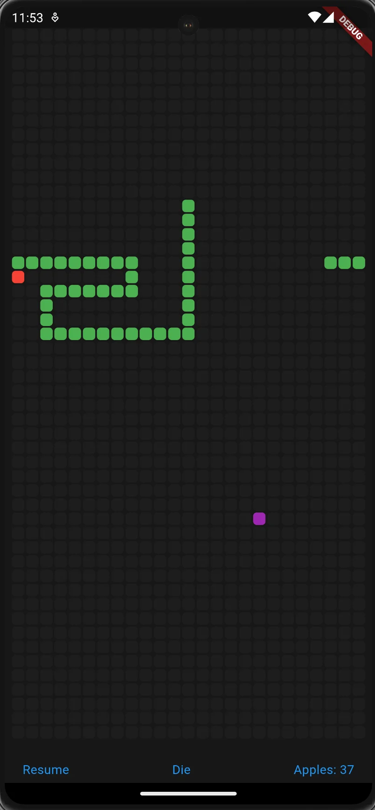
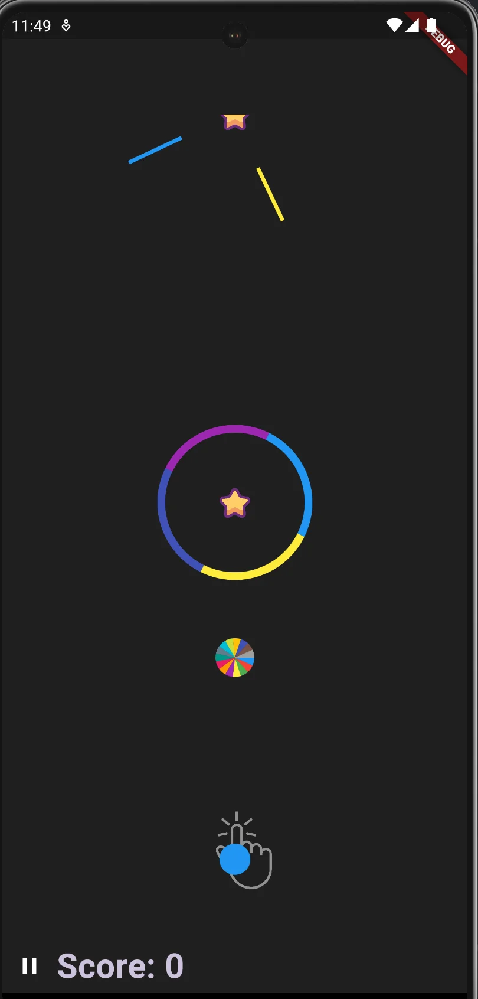
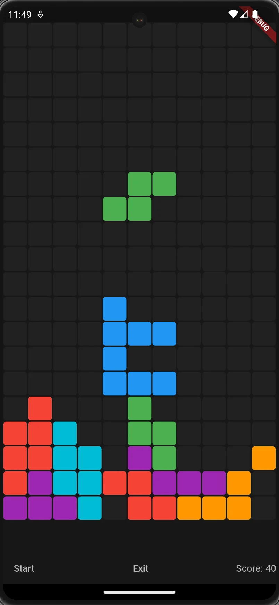

# :fountain_pen:  Games App

With this project I wanted to put my programming logic into practice. And I'm really putting them into practice! My goal is to recreate each mobile game and then improve it or add a few extra features and improvements. I also want to modify the games to be multiplayer and playable online.

# My Role

## :hammer_and_wrench: Responsabilities:

- Implement the logic of each game
- Build the mobile app
- Find a way to adapt the games to be multiplayer
- Adding new features to each game

# The Project

## :mag_right: Challenges:

- The logic of each game. There were times where I was litteraly stuck trying to implement the logic correctly. I watched some vides, used chatgpt, used stackoverflow to complete what I wanted. Another big challenge was setting the server for multiplayer games. It was my frist time doing that. I needed to learn a little of mongoDB, and  how to connect my database with the game. 

## :moneybag: Outcome:

- It is not complete yet, but it's fun to face and overcome the challenges. My programming logic has improved, and I have a clearer idea of making full stack applications. 

